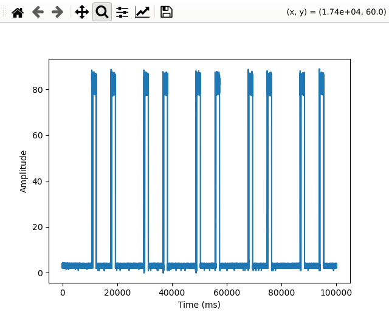
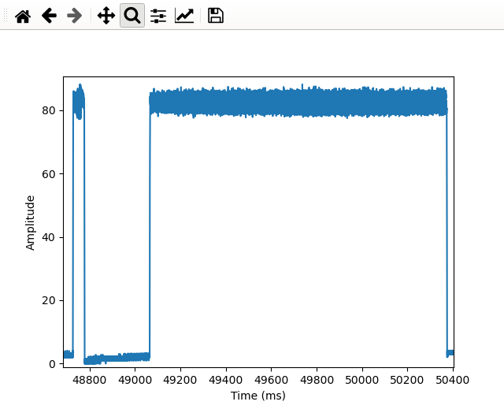
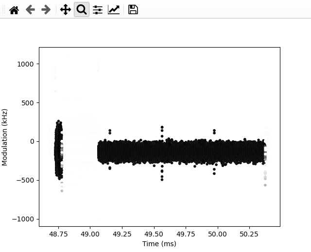
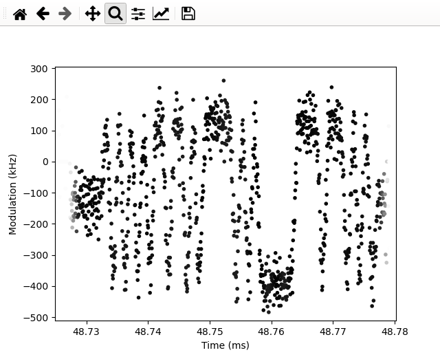
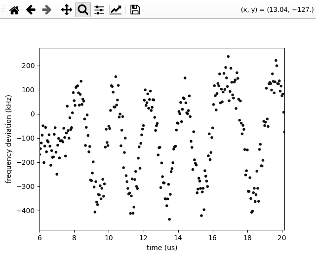
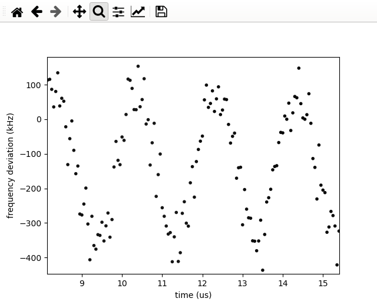
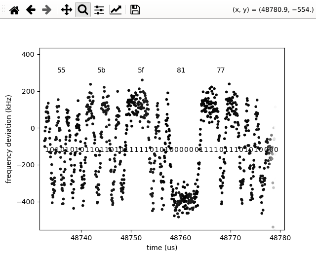
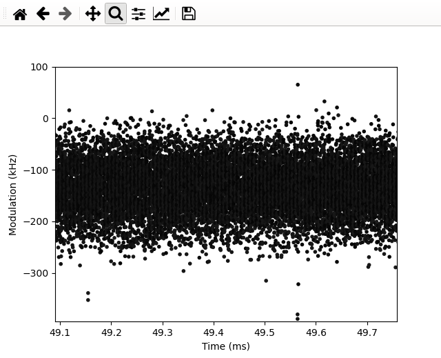
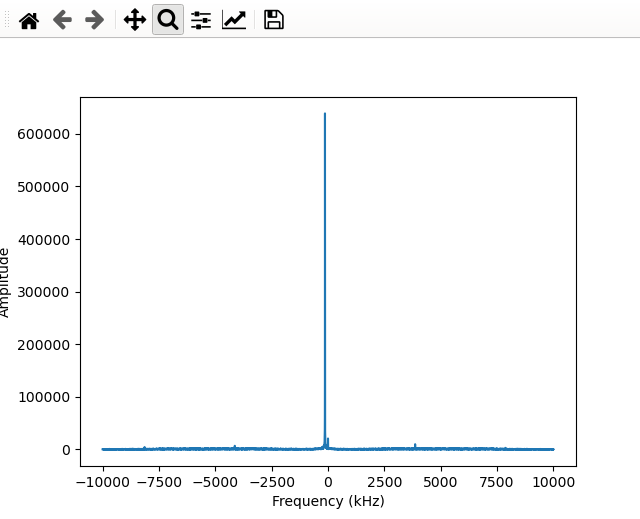
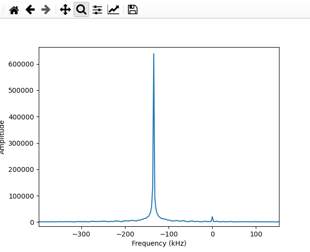

# RF Tools

Humble beginings as tool to process IQdata sampled from HackRF One.  Hoping it can be applied to Rohde&Schwarz which appears to be a powerful device, but accessible through slightly inflexible applications.

Example HackRF usage:
```
hackrf_transfer -f 2404000000 -s 20000000 -b 15000000 -r 2404cstest-0x0401-20MHz.iq -n 2000000
```

* `-f 2404000000` RF frequency 2404 MHz
* `-s 20000000` Sampling frequency 20MHz
* `-b 15000000` Bandwidth 15 MHz
* `-r 2404cstest-0x0401-20MHz.iq`
* `-n 2000000` 2 Msamples thus 100 ms

## Python Script
```
usage: analyze.py [-h] --iq IQ --f-sample F_SAMPLE [--amp AMP] [--phase PHASE]
                  [--sine] [--fft] [--left LEFT] [--right RIGHT]
                  [--preamble PREAMBLE] [--N N]
analyze.py: error: the following arguments are required: --iq, --f-sample
```

Currently can display frequency spectra of selected region or decoding of Bluetooth 1M PHY.

Work flow:  Initially plots amplitude of entire file.  Selecting a region (zoom) will pass the range selected to the next stage when graph is closed.  After selecting range in amplitude view, range is plotted as modulation, with darkness of point corresponding to amplitude. After modulation graph is closed, either spectra is plotted (`--FFT`) or default is to decode as 1M PHY.  In decode mode, additional modulation graph is displayed, a symmetric selection of preamble should be selected (for example if `10101010` is preamble, select from peak of first `1` to bottom of last `0`.  This region us used to sync start of symbols.

The various plots can be skipped by providing sample indexes in `left,right` format to `--amp`, `--phase` (this name probably will change) and `--preamble`.

### Example Decoding
```
python3 analyze.py --iq 2404cstest-0x0401-20MHz.iq --N 9 --f-sample=20000000
```
Amplitude graph is displayed:



Selecting a single CS subevent (NCP Host is repeatedly calling `sl_bt_cs_test_start()`).  First packet is the CS SYNC, second is Stable Phase tone:



Closing amplitude window, modulation view of zoom region opens:



Zooming in on CS SYNC packet:



This will be the region to be decoded.  Closing the window, the same region is graphed again.  The exercise here is to select the preamble.  Zooming in on first 20 us, the preamble can be recognized as `10101010`.



Selecting from the top of first `1` to bottom of fourth `0`



Closing this graph opens a decoded graph of the CS SYNC packet



The sync word observed is consistent with Network Analyzer captured packet.
### Example FFT
```
python3 ~/src/HackRF/analyze.py --iq 2404cstest-0x0401-20MHz.iq --N 9 --f-sample=20000000 --amp=974444,995659 --fft
```

Selecting range /inside/ Stable Modulation tone packet



Closing window, opens frequency spectra ofselected region:




Evidently there is a 134 kHz disagreement between carrier frequency of EFR32 board and HackRF One (56 PPM).
